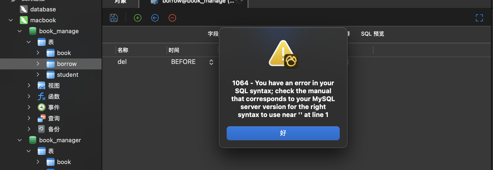
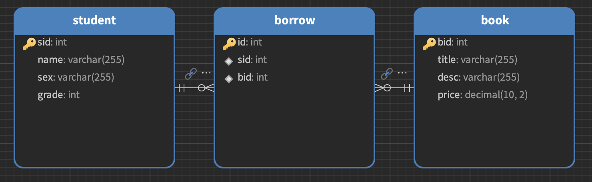
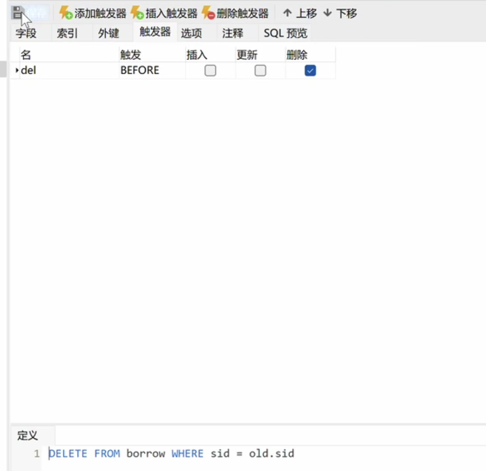
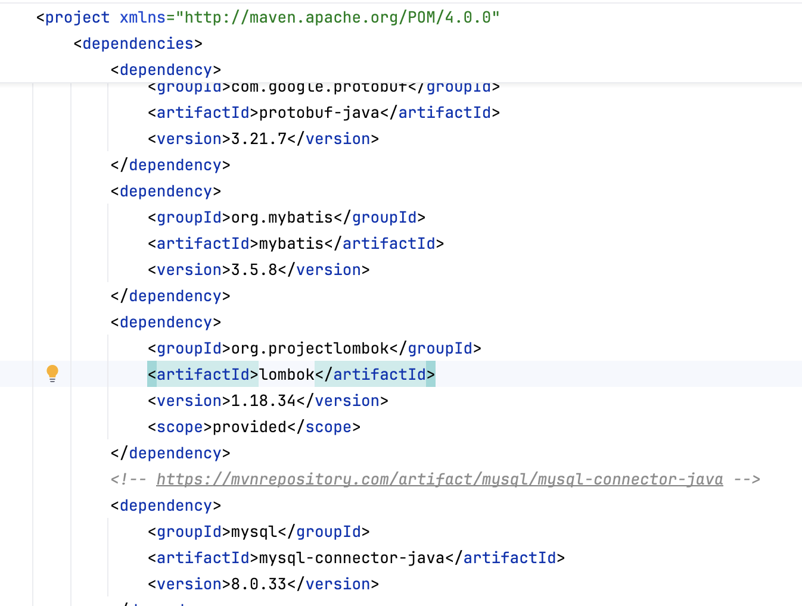
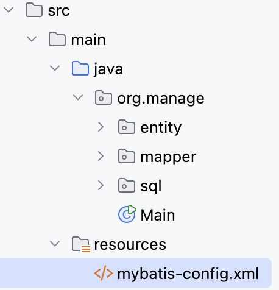
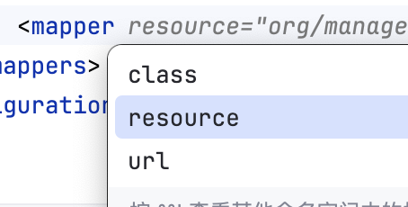

# 图书管理系统(demo)

> 只涉及后端内容，前端先展示不写 ，目的是熟练/强化mybatis/junit/lombok

## 项目需求

* 在线录入学生信息和书籍信息
* 查询书籍信息列表
* 查询学生信息列表
* 查询借阅信息列表
* 完整的日志系统

> 打草稿列出思维和步骤，根据思维和步骤完成README.md的笔记记录。

## 1.创建数据库

> 使用可视化数据库管理工具navicat

问题是无法创建触发器？？



无论我如何操控borrow表都无法创建触发器？似乎mysql 9.0就是不支持触发器？？

解决方案：

- 使用VPS提供的数据库
- 使用数据库外键的连级删除来实现触发器功能

数据库视图如下：



> 注意给主键设自增属性

> 有时候分级标题少点也不错

结论：

- 与Mysql数据库版本无关
- 需要自定义触发器的实现



> 注意看定义这里，触发条件是before，内容显而易见了

```sql
DELETE FROM borrow WHERE sid=oid.sid;
```

这个触发器的作用是在student表中删除一条记录后，自动删除表中所有与该[student记录相关的记录。这有助于维护数据库的参照完整性，确保在删除student记录后，不会在borrow表中留下孤立的记录。

## 2.创建maven项目

需要的包大概如图示：



> 因为我使用的JDK蛮新的，务必使用最新的包

> 网站如下：https://mvnrepository.com

## 3.mybatis-config.xml配置数据库

```xml
<?xml version="1.0" encoding="UTF-8" ?>
<!DOCTYPE configuration
        PUBLIC "-//mybatis.org//DTD Config 3.0//EN"
        "http://mybatis.org/dtd/mybatis-3-config.dtd">
<configuration>
    <environments default="development">
        <environment id="development">
            <transactionManager type="JDBC"/>
            <dataSource type="POOLED">
                <property name="driver" value="com.mysql.cj.jdbc.Driver"/>
                <property name="url" value="jdbc:mysql://localhost:3306/book_manage"/>
                <property name="username" value="root"/>
                <property name="password" value="mobaisilent"/>
            </dataSource>
        </environment>
    </environments>
    <mappers>
        <mapper class="org.manage.mapper.BookMapper"/>
    </mappers>
    <!-- 注意mapper这里，注意导入mapper的三种形式 -->
</configuration>
```

位置如下：（方便导入





> 这三种形式的差异见Mybatis的详细笔记

## 4.创建几个资源包如下

主包：com.test

entity

- Student

  - int id
  - final String name
  - fianl String sex
  - final grade

  > 这里注意@Data注解对于必须项需要final修饰
  >
  > 具体看Lombok的相关笔记

- Book

> 用Lombok创建实体类
>
> 注意将IDEA的注解功能开启

mapper

- BookMapper

