# 图书管理系统(demo)

> 只涉及后端内容，前端先展示不写 ，目的是熟练/强化mybatis/junit/lombok

> 使用最新学习体系和方案 -> 给予高度认可。

## 项目需求

* 在线录入学生信息和书籍信息
* 查询书籍信息列表
* 查询学生信息列表
* 查询借阅信息列表
* 完整的日志系统

> 打草稿列出思维和步骤，根据思维和步骤完成README.md的笔记记录。

技术栈

- Mybatis
- Lombok
- Mysql
- Maven

## 1.创建数据库

> 使用可视化数据库管理工具navicat

问题是无法创建触发器？？


无论我如何操控borrow表都无法创建触发器？似乎mysql 9.0就是不支持触发器？？

解决方案：

- 使用VPS提供的数据库
- 使用数据库外键的联级删除来实现触发器功能

数据库视图如下：


> 注意给主键设自增属性

> 有时候分级标题少点也不错

结论：

- 与Mysql数据库版本无关
- 需要自定义触发器的实现


> 注意看定义这里，触发条件是before，内容显而易见了

```sql
DELETE FROM borrow WHERE sid=oid.sid;
```

这个触发器的作用是在student表中删除一条记录后，自动删除表中所有与该student记录相关的记录。这有助于维护数据库的参照完整性，确保在删除student记录后，不会在borrow表中留下孤立的记录。

> 现在问题/bug是即使我配置好了触发器还是无法通过触发器实现联级删除，还是继续通过外键的联级删除实现吧
>
> 外键那里改为desc即可

注意IDEA中添加数据源之后编辑器中的报黄就会自动变为绿色

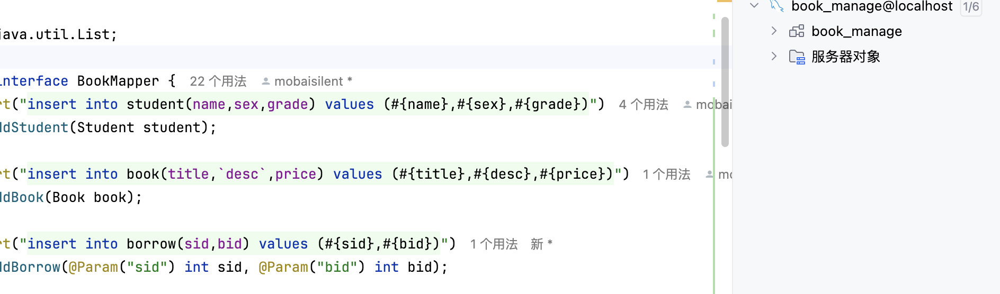

## 2.创建maven项目

需要的包大概如图示：


> 因为我使用的JDK蛮新的，务必使用最新的包

> 网站如下：https://mvnrepository.com

## 3.mybatis-config.xml配置数据库

```xml
<?xml version="1.0" encoding="UTF-8" ?>
<!DOCTYPE configuration
        PUBLIC "-//mybatis.org//DTD Config 3.0//EN"
        "http://mybatis.org/dtd/mybatis-3-config.dtd">
<configuration>
    <environments default="development">
        <environment id="development">
            <transactionManager type="JDBC"/>
            <dataSource type="POOLED">
                <property name="driver" value="com.mysql.cj.jdbc.Driver"/>
                <property name="url" value="jdbc:mysql://localhost:3306/book_manage"/>
                <property name="username" value="root"/>
                <property name="password" value="mobaisilent"/>
            </dataSource>
        </environment>
    </environments>
    <mappers>
        <mapper class="org.manage.mapper.BookMapper"/>
    </mappers>
    <!-- 注意mapper这里，注意导入mapper的三种形式 -->
</configuration>
```

位置如下：（方便导入


> 这三种形式的差异见Mybatis的详细笔记

## 4.创建几个资源包如下

主包：com.test

entity

- Student

  - int id
  - final String name
  - fianl String sex
  - final grade

  > 这里注意@Data注解对于必须项需要final修饰
  >
  > 具体看Lombok的相关笔记

- Book

> 用Lombok创建实体类
>
> 注意将IDEA的注解功能开启

mapper

- BookMapper
  - 这里是用Myabatis的接口方式实现

> 先暂时介绍这几个类，其作用显而易见吧

Student.java

```java
package org.manage.entity;

import lombok.Data;

@Data
public class Student {
  int sid;
  final String name;
  final String sex;
  final int grade;
}
// LomBok的初次使用记得将idea的注解开启
```

Book.java略

BookMapper.java

```java
package org.manage.mapper;

import org.apache.ibatis.annotations.Insert;
import org.manage.entity.Book;
import org.manage.entity.Student;

public interface BookMapper {
  @Insert("insert into student(name,sex,grade) values (#{name},#{sex},#{grade})")
  int addStudent(Student student);
  // 创建好了数据库，自增主键的话不需要手动添加id了

  @Insert("insert into borrow(sid,bid) values (#{sid},#{bid})")
  int borrowBook(int sid, int bid);

  @Insert("insert into book(title,desc,price) values (#{title},#{desc},#{price})")
  int addBook(Book book);
}
```

Main.java

## 5.书写Main.java

```java
package org.manage;

import org.apache.ibatis.io.Resources;
import org.apache.ibatis.session.SqlSession;
import org.apache.ibatis.session.SqlSessionFactory;
import org.apache.ibatis.session.SqlSessionFactoryBuilder;
import org.manage.entity.Student;
import org.manage.mapper.BookMapper;

import java.io.IOException;

public class Main {
  public static void main(String[] args) throws IOException {
    SqlSessionFactory factory = new SqlSessionFactoryBuilder().build(Resources.getResourceAsReader("mybatis-config.xml"));
    try (SqlSession sqlSession = factory.openSession(true)) {
      BookMapper mapper = sqlSession.getMapper(BookMapper.class);
      // 通过动态代理的方式，创建了一个实现类
      System.out.println(mapper.addStudent(new Student("张三", "男", 1)));
    } catch (Exception e) {
      e.printStackTrace();
    }
  }
}
// factory -> sqlSession -> mapper
```

## 6.封装Main.java的数据库操作到工具类中

> 注意工具类如何书写
>
> - 静态方法
> - private对象

SqlUtil.java

```java
package org.manage.sql;

import org.apache.ibatis.io.Resources;
import org.apache.ibatis.session.SqlSession;
import org.apache.ibatis.session.SqlSessionFactory;
import org.apache.ibatis.session.SqlSessionFactoryBuilder;

import java.io.IOException;

public class SqlUtil {
  private SqlUtil() {
  }

  private static SqlSessionFactory factory;

  static {
    try {
      factory = new SqlSessionFactoryBuilder().build(Resources.getResourceAsReader("mybatis-config.xml"));
    } catch (IOException e) {
      e.printStackTrace();
    }
  }

  public static SqlSession getSession() {
    return factory.openSession(true);
  }
}
// 创建工具类 SqlUtil，用于获取 SqlSession 对象 显然易见，使用方式 SqlUtile.getSession() 即可获取 SqlSession 对象
```

## 7.工具类的应用

> 封装很简单，主要是应用上

显然可以通过sqlSession获取Mapper但是还有更好的方式

```java
BookMapper mapper = SqlUtil.getSession().getMapper(BookMapper.class);
```

使用工具类的测试结果：

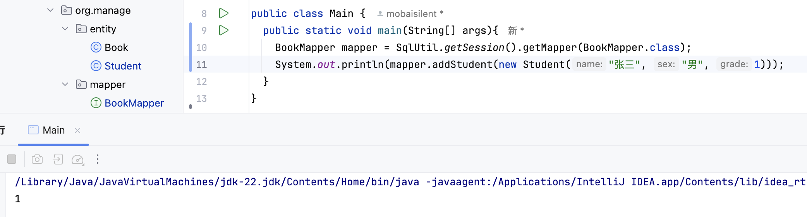

> 显然这样测试是正确的，能正确操作数据库

```java
package org.manage;

import org.manage.entity.Student;
import org.manage.mapper.BookMapper;
import org.manage.sql.SqlUtil;

public class Main {
  public static void main(String[] args){
    BookMapper mapper = SqlUtil.getSession().getMapper(BookMapper.class);
    System.out.println(mapper.addStudent(new Student("张三", "男", 1)));
  }
}
```

> 这是基本使用，下面是函数式编程

## 8.工具类的函数式编程

修改工具类

```java
package org.manage.sql;

import org.apache.ibatis.io.Resources;
import org.apache.ibatis.session.SqlSession;
import org.apache.ibatis.session.SqlSessionFactory;
import org.apache.ibatis.session.SqlSessionFactoryBuilder;
import org.manage.mapper.BookMapper;

import java.io.IOException;
import java.util.function.Consumer;

public class SqlUtil {
  private SqlUtil() {
  }

  private static SqlSessionFactory factory;
  // 私有的static对象

  static {
    try {
      factory = new SqlSessionFactoryBuilder().build(Resources.getResourceAsReader("mybatis-config.xml"));
      // 注意后面读取xml的方式
    } catch (IOException e) {
      e.printStackTrace();
    }
  }

  public static void doSqlWork(Consumer<BookMapper> consumer){
    try(SqlSession session=factory.openSession(true)){
        BookMapper mapper = session.getMapper(BookMapper.class);
        consumer.accept(mapper);
    }
  }
}
// 创建工具类 SqlUtil，用于获取 SqlSession 对象 显然易见，使用方式 SqlUtile.getSession() 即可获取 SqlSession 对象
```

修改Main

```java
package org.manage;

import org.manage.entity.Student;
import org.manage.mapper.BookMapper;
import org.manage.sql.SqlUtil;

public class Main {
  public static void main(String[] args){
    SqlUtil.doSqlWork(mapper ->{
        Student student = new Student("张三", "男", 1);
        System.out.println(mapper.addStudent(student));
    });
  }
}
```

> 测试成功

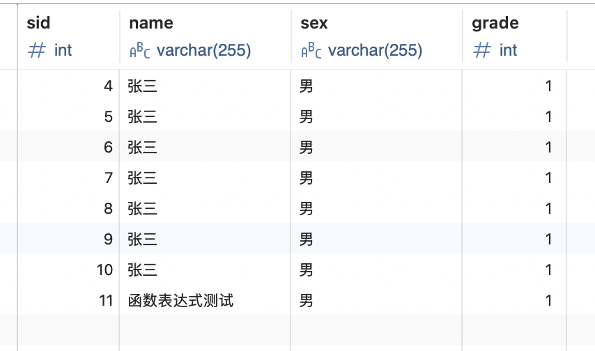

> 现代lambda函数编程更为流行

## 9.导航式功能管理

> 使用Swtich case语句完成，注意处理换行符

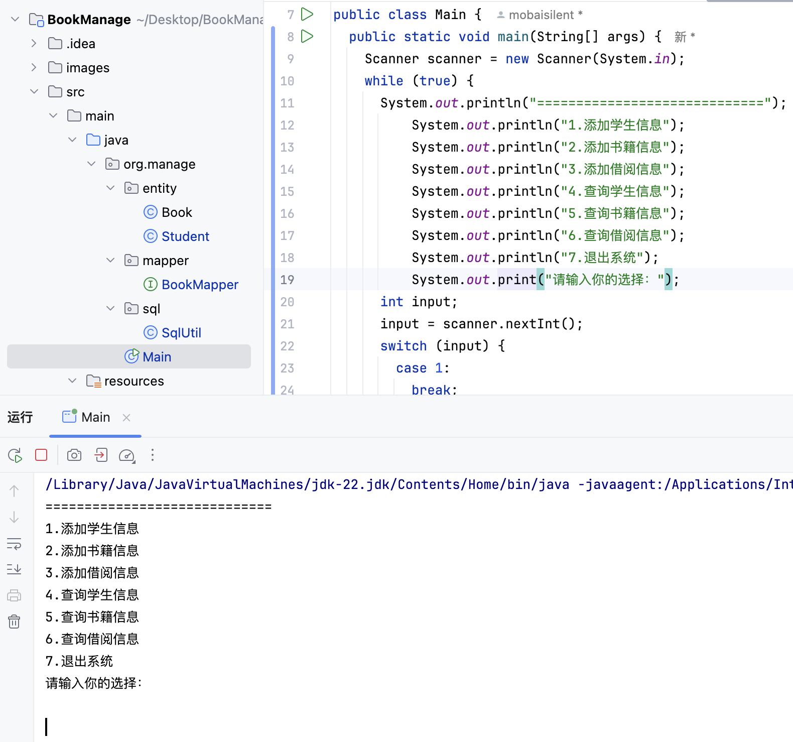

> 看我的switch处理，可见我的输入使用问题的，但是没有任何响应吧

bug处理：

```java
String input = scanner.nextLine();
int check;
try {
  check = Integer.parseInt(input);
} catch (NumberFormatException e) {
  System.out.println("请输入正确的数字！！！");
  continue;
}
// 能够处理最开始的乱输入问题
```

带有Swtich的Main类：

```java
package org.manage;

import java.util.Scanner;

import static java.lang.System.exit;

public class Main {
  public static void main(String[] args) {
    Scanner scanner = new Scanner(System.in);
    while (true) {
      System.out.println("=============================");
      System.out.println("1.添加学生信息");
      System.out.println("2.添加书籍信息");
      System.out.println("3.添加借阅信息");
      System.out.println("4.查询学生信息");
      System.out.println("5.查询书籍信息");
      System.out.println("6.查询借阅信息");
      System.out.println("7.退出系统");
      System.out.print("请输入你的选择：");
      String input = scanner.nextLine();
      int check;
      try {
        check = Integer.parseInt(input);
      } catch (NumberFormatException e) {
        System.out.println("请输入正确的数字！！！");
        continue;
      }
      // 处理数据输入，
      switch (check) {
        case 1:
          break;
        case 2:
          break;
        case 3:
          break;
        case 4:
          break;
        case 5:
          break;
        case 6:
          break;
        case 7:
          exit(0);
        default:
          break;
      }
    }
  }
}
```

> 导航栏创建无误，基本的错误也得到了处理

添加case 1的处理如下：添加一个private static静态方法直接使用即可：

```java
  private static void addStudent(Scanner scanner) {
    System.out.print("请输入学生姓名：");
    String name = scanner.nextLine();
    System.out.print("请输入学生性别(boy/girl)：");
    String sex = scanner.nextLine();
    System.out.print("请输入学生年级：");
    String stringGrade = scanner.nextLine();
    int grade = Integer.parseInt(stringGrade);
    SqlUtil.doSqlWork(mapper -> {
      int result = mapper.addStudent(new Student(name, sex, grade));
      if (result > 0) System.out.println("添加成功");
    });
  }
```

添加book信息和borrow信息略

## 10.测试前面几个基本功能是否完成

- 学生信息录入 -> ok
- 书籍信息录入 -> bug如下
- 借阅信息录入 -> 拓展如下

1. 提示说desc那里有问题，将addBook方法上面的注入里面的desc用飘号包括即可

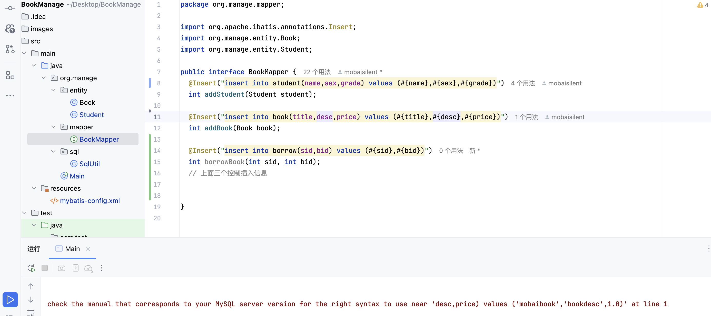

> 原因是因为desc是Java的关键字

2. 上面的borrowBook的注入有问题，两个参数的情况不能这么简单的就传递了

> 具体参考Mybatis的笔记

修改为下面这样：

```java
@Insert("insert into borrow(sid,bid) values (#{sid},#{bid})")
int addBorrow(@Param("sid") int sid,@Param("bid") int bid);
```

> 修改成这样就可以了

下面给大家总结了以下几种多参数传递的方法。

方法1：顺序传参法

```
public User selectUser(String name, int deptId);

<select id="selectUser" resultMap="UserResultMap">
    select * from user
    where user_name = #{0} and dept_id = #{1}
</select>
```

`#{}`里面的数字代表你传入参数的顺序。

这种方法不建议使用，sql层表达不直观，且一旦顺序调整容易出错。

方法2：@Param注解传参法

```
public User selectUser(@Param("userName") String name, int @Param("deptId") deptId);

<select id="selectUser" resultMap="UserResultMap">
    select * from user
    where user_name = #{userName} and dept_id = #{deptId}
</select>
```

`#{}`里面的名称对应的是注解 `@Param`括号里面修饰的名称。

这种方法在参数不多的情况还是比较直观的，推荐使用。

方法3：Map传参法

```
public User selectUser(Map<String, Object> params);

<select id="selectUser" parameterType="java.util.Map" resultMap="UserResultMap">
    select * from user
    where user_name = #{userName} and dept_id = #{deptId}
</select>
```

`#{}`里面的名称对应的是 `Map`里面的key名称。

这种方法适合传递多个参数，且参数易变能灵活传递的情况。

方法4：Java Bean传参法

```
public User selectUser(User params);

<select id="selectUser" parameterType="com.test.User" resultMap="UserResultMap">
    select * from user
    where user_name = #{userName} and dept_id = #{deptId}
</select>
```

`#{}`里面的名称对应的是 `User`类里面的成员属性。

这种方法很直观，但需要建一个实体类，扩展不容易，需要加属性，看情况使用。

> 我个人比较喜欢方法2，注解传参比较直观

## 11.日志系统

> 这里是借助了Lombok的日志系统

写入logging.properties如下

```properties
handlers=java.util.logging.FileHandler
.level=ALL
java.util.logging.FileHandler.pattern = console.log
java.util.logging.FileHandler.limit = 50000
java.util.logging.FileHandler.count = 1
java.util.logging.FileHandler.formatter = java.util.logging.SimpleFormatter
java.util.logging.FileHandler.append = true
# 从上到下
# handler 用来指定日志处理器
# .level 用来指定日志级别
# java.util.logging.FileHandler.pattern 用来指定日志文件的路径
# java.util.logging.FileHandler.limit 用来指定日志文件的大小
# java.util.logging.FileHandler.count 用来指定日志文件的数量
# java.util.logging.FileHandler.formatter 用来指定日志的格式
# java.util.logging.FileHandler.append 用来指定是否追加日志
# 最重要的是patter formatter 和append
```

日志系统的作用是方便自己查阅和储存敏感操作。

如果要debug的话保存的日志信息就是越详细越好。

然后限制文件大小就行，超过就把日志文件删了，重新保存一个文件，所以一般出现问题的时候也不会这么巧恰好日志文件被删了。

使用日志系统：修改了主类如下所示：

```java
@Log
public class Main {
  public static void main(String[] args) throws IOException {
    LogManager manager = LogManager.getLogManager();
    manager.readConfiguration(Resources.getResourceAsStream("logging.properties"));
    // 这里是借助了Lombok的日志系统
    log.info("程序开始运行");
    log.info("hello world");
```

保存的信息如下：

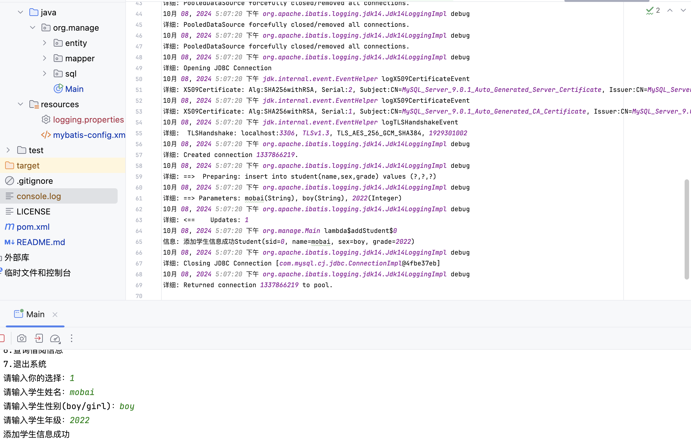

可见添加了一个学生但是保存的日志信息过多了，把Mybatis的运行日志也保存进去了

解决方案为修改日志等级 .level=INFO 其他不需要修改

结果如下：

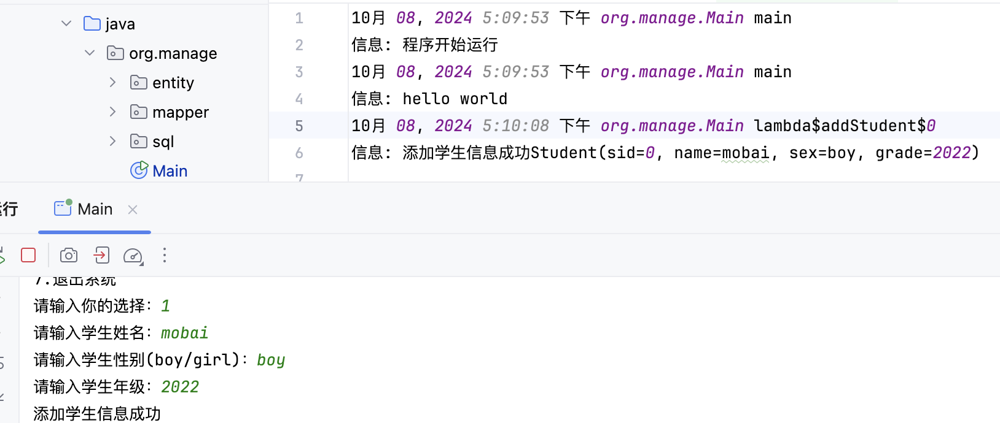

再在对应的位置（需要保持日志的部分）将日志系统插入保存即可。

结果如下：

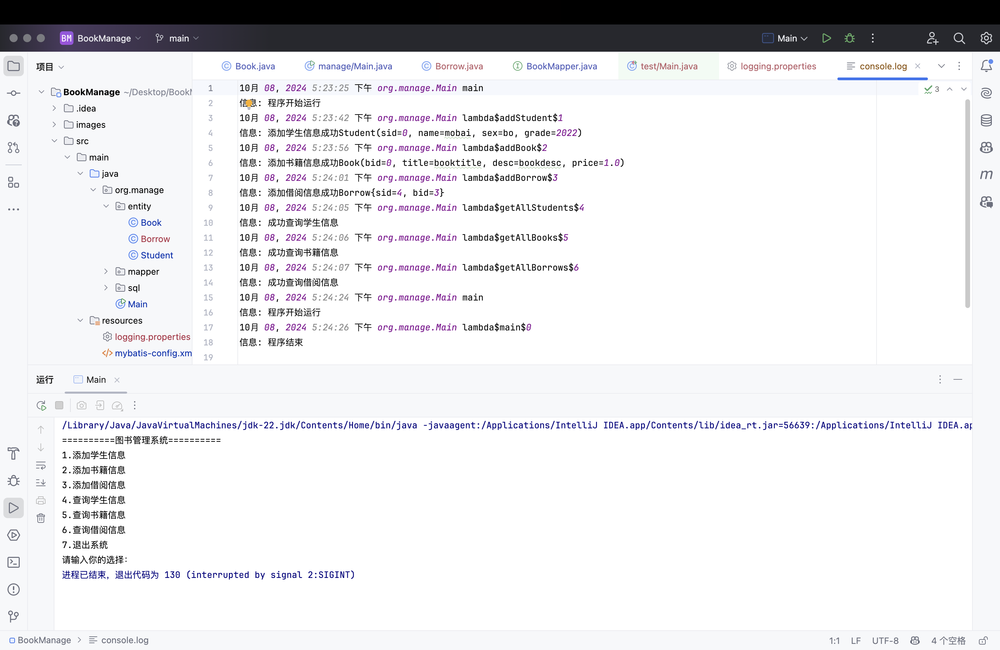

非常的完美，注意输入7关闭不会保存“程序结束”的日志信息，需要到case 7那里单独处理下。

拓展部分：

```java
log.info("程序开始运行");
Runtime.getRuntime().addShutdownHook(new Thread(() -> log.info("程序结束")));
```

这行代码向Java运行时添加了一个关闭钩子。关闭钩子是在JVM关闭时执行的线程，这对于执行清理操作（如记录日志、关闭资源或保存状态）非常有用。

```java
case 7:
  log.info("程序主动退出");
  exit(0);	
```

## 12.借阅信息处理

> 前面部分是插入操作 直接添加了插入操作，没有映射到对象类中

这里是处理查询所有的借阅信息

先处理查询学生信息的映射关系：修改Mapper如下

```java
package org.manage.mapper;

import org.apache.ibatis.annotations.*;
import org.apache.ibatis.type.JdbcType;
import org.manage.entity.Book;
import org.manage.entity.Borrow;
import org.manage.entity.Student;

import java.util.List;

public interface BookMapper {
  @Insert("insert into student(name,sex,grade) values (#{name},#{sex},#{grade})")
  int addStudent(Student student);

  @Insert("insert into book(title,`desc`,price) values (#{title},#{desc},#{price})")
  int addBook(Book book);

  @Insert("insert into borrow(sid,bid) values (#{sid},#{bid})")
  int addBorrow(@Param("sid") int sid, @Param("bid") int bid);

  @Results({
          @Result(id = true, column = "sid", property = "sid"),
          @Result(column = "sex", property = "sex", javaType = String.class, jdbcType = JdbcType.VARCHAR),
          @Result(column = "name", property = "name"),
          @Result(column = "grade", property = "grade")
  })
  @Select("select * from student where sid = #{sid}")
  Student getStudentById(int sid);

  @Select("select * from book where bid = #{bid}")
  Book getBookById(int bid);

  @Select("select * from student")
  List<Student> getAllStudents();

  @Select("select * form book")
  List<Book> getAllBooks();

  @Select("select * from borrow")
  List<Borrow> getAllBorrows();
}
```

修改BookMapper如上所示。问题和教程一致了无法实现映射（学生）

在Test中的代码如下：

```java
package com.test;

import org.junit.Test;
import org.manage.sql.SqlUtil;

public class Main {
    @Test
    public void test1() {
        SqlUtil.doSqlWork(mapper -> {
            System.out.println(mapper.getStudentById(5).toString());
        });
    }
}
```

> 确保5号学生是实际存在的

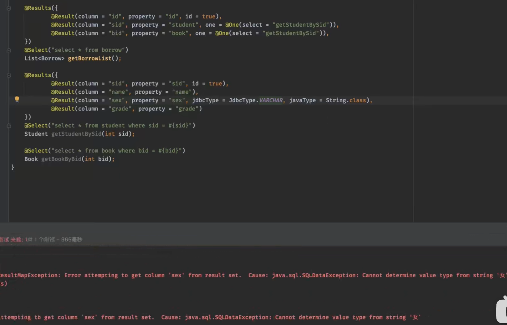

> 教程报错如下

> 原因是设置的final所以无法确定三个参数的基本类型

解决方案是手动创建少个参数的构造函数。

```java
package org.manage.entity;

import lombok.Data;
import lombok.NoArgsConstructor;

@Data
@NoArgsConstructor
public class Student {
  int sid;

  public Student(String name, String sex, int grade) {
    this.name = name;
    this.sex = sex;
    this.grade = grade;
  }
  // 自己创建一个允许少个参数的无参构造

  String name;
  String sex;
  int grade;

}
```

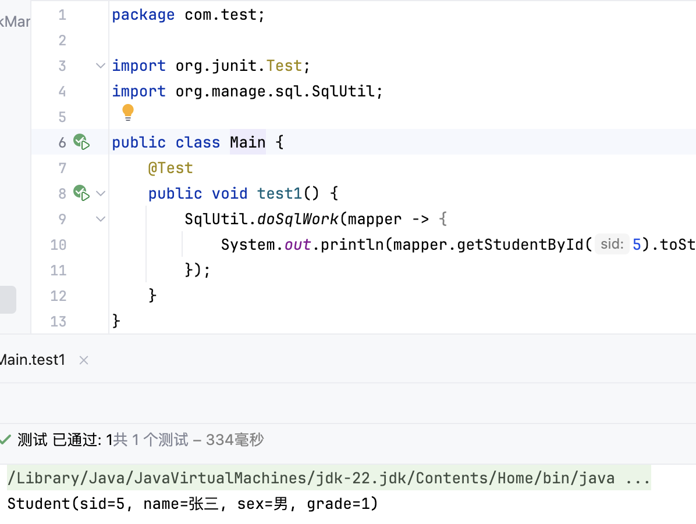


> 测试成功

其他Book和Borrow的处理方式同理即可

把@Result注释信息删掉依旧成功

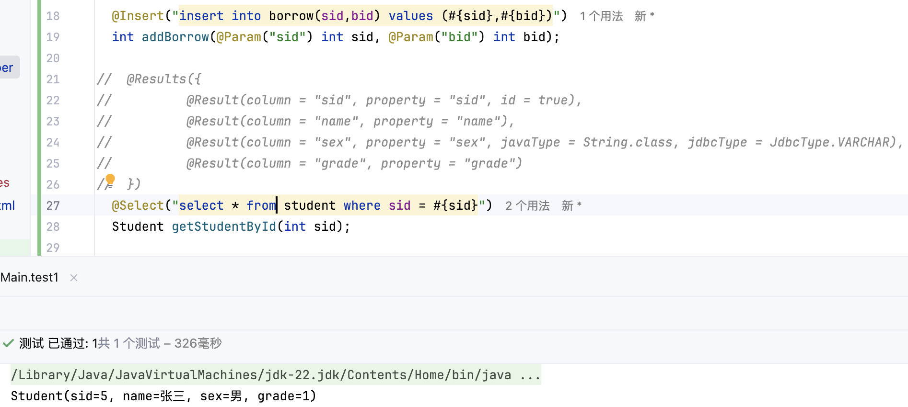

尝试处理Borrow但是bug如下：

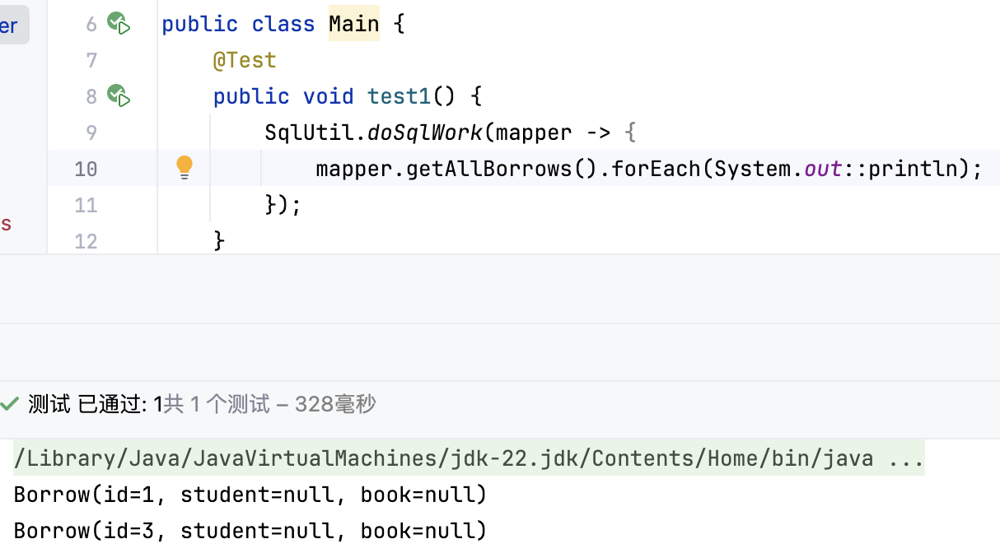

显然是信息处理不到位，没有处理好BookMapper这个接口中的getAllBorrows方法

修改BookMapper创建映射关系：

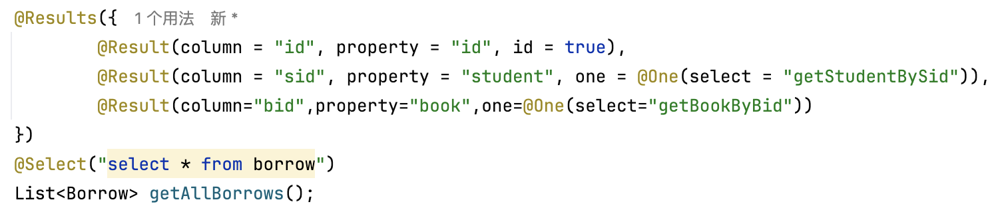

修改Book和上面Student一样，自建一个允许的少参构造：

略

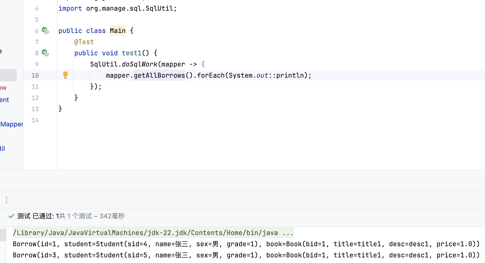

结果正确，现在回过头来处理日志系统

> 显然我日志系统没学好，纸上谈兵只是看了视频但是不会用罢了。

处理好查询系统，该后端就基本已经完成了，补全Main代码即可。

注：补全代码交给GPT即可，自己写一两个给GPT作为示范/参考

```java
package org.manage;

import org.manage.entity.Book;
import org.manage.entity.Student;
import org.manage.entity.Borrow; // 假设你有 Borrow 类
import org.manage.sql.SqlUtil;

import java.io.IOException;
import java.util.List;
import java.util.Scanner;
import java.util.logging.LogManager;
import java.util.logging.Logger;

import static java.lang.System.exit;
import static org.apache.ibatis.io.Resources.getResourceAsStream;

public class Main {
  public static void main(String[] args) throws IOException {
    LogManager manager = LogManager.getLogManager();
    manager.readConfiguration(getResourceAsStream("logging.properties"));
    Logger logger = Logger.getLogger(Main.class.getName());
    logger.info("程序开始运行");
    Scanner scanner = new Scanner(System.in);
    while (true) {
      System.out.println("=============================");
      System.out.println("1.添加学生信息");
      System.out.println("2.添加书籍信息");
      System.out.println("3.添加借阅信息");
      System.out.println("4.查询学生信息");
      System.out.println("5.查询书籍信息");
      System.out.println("6.查询借阅信息");
      System.out.println("7.退出系统");
      System.out.print("请输入你的选择：");
      String input = scanner.nextLine();
      int check;
      try {
        check = Integer.parseInt(input);
      } catch (NumberFormatException e) {
        System.out.println("请输入正确的数字！！！");
        continue;
      }
      // 处理数据输入，
      switch (check) {
        case 1:
          addStudent(scanner);
          break;
        case 2:
          addBook(scanner);
          break;
        case 3:
          addBorrow(scanner);
          break;
        case 4:
          getAllStudents();
          break;
        case 5:
          getAllBooks();
          break;
        case 6:
          getAllBorrows();
          break;
        case 7:
          exit(0);
        default:
          System.out.println("无效选择，请重试。");
          break;
      }
    }
  }

  private static void addStudent(Scanner scanner) {
    System.out.print("请输入学生姓名：");
    String name = scanner.nextLine();
    System.out.print("请输入学生性别(boy/girl)：");
    String sex = scanner.nextLine();
    System.out.print("请输入学生年级：");
    String stringGrade = scanner.nextLine();
    int grade = Integer.parseInt(stringGrade);
    SqlUtil.doSqlWork(mapper -> {
      int result = mapper.addStudent(new Student(name, sex, grade));
      if (result > 0) System.out.println("添加学生信息成功");
    });
  }

  private static void addBook(Scanner scanner) {
    System.out.print("请输入书籍名称：");
    String title = scanner.nextLine();
    System.out.print("请输入书籍描述：");
    String desc = scanner.nextLine();
    System.out.print("请输入书籍价格：");
    String stringPrice = scanner.nextLine();
    double price = Double.parseDouble(stringPrice);
    SqlUtil.doSqlWork(mapper -> {
      int result = mapper.addBook(new Book(title, desc, price));
      if (result > 0) System.out.println("添加书籍信息成功");
    });
  }

  private static void addBorrow(Scanner scanner) {
    System.out.print("请输入学生id：");
    String stringSid = scanner.nextLine();
    int sid = Integer.parseInt(stringSid);
    System.out.print("请输入书籍id：");
    String stringBid = scanner.nextLine();
    int bid = Integer.parseInt(stringBid);
    SqlUtil.doSqlWork(mapper -> {
      int result = mapper.addBorrow(sid, bid);
      if (result > 0) System.out.println("添加借阅信息成功");
    });
  }

  private static void getAllStudents() {
    SqlUtil.doSqlWork(mapper -> {
      List<Student> students = mapper.getAllStudents();
      if (students.isEmpty()) {
        System.out.println("没有找到学生信息。");
      } else {
        System.out.println("学生信息：");
        for (Student student : students) {
          System.out.println(student);
        }
      }
    });
  }

  private static void getAllBooks() {
    SqlUtil.doSqlWork(mapper -> {
      List<Book> books = mapper.getAllBooks();
      if (books.isEmpty()) {
        System.out.println("没有找到书籍信息。");
      } else {
        System.out.println("书籍信息：");
        for (Book book : books) {
          System.out.println(book);
        }
      }
    });
  }

  private static void getAllBorrows() {
    SqlUtil.doSqlWork(mapper -> {
      List<Borrow> borrows = mapper.getAllBorrows();
      if (borrows.isEmpty()) {
        System.out.println("没有找到借阅信息。");
      } else {
        System.out.println("借阅信息：");
        for (Borrow borrow : borrows) {
          System.out.println(borrow);
        }
      }
    });
  }
}
```

> 可见GPT的信息处理还行
>
> 测试略，实测没问题

## 13.打包并且在外部运行

直接打包报错如下：

> java -jar jar包路径

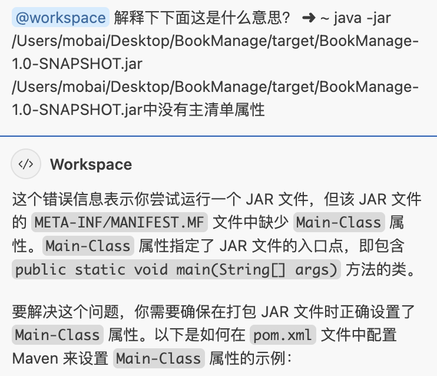

修改如下：

在xml的dependencies后面加上build组件

> 我确保我的组件都是最新的

```xml
  <build>
      <plugins>
          <plugin>
              <artifactId>maven-assembly-plugin</artifactId>
              <version>3.7.1</version>
              <configuration>
                  <descriptorRefs>
                      <descriptorRef>jar-with-dependencies</descriptorRef>
                  </descriptorRefs>
                  <archive>
                      <manifest>
                          <addClasspath>true</addClasspath>
                          <mainClass>org.manage.Main</mainClass>
                      </manifest>
                  </archive>
              </configuration>
              <executions>
                  <execution>
                      <id>make-assembly</id>
                      <phase>package</phase>
                      <goals>
                          <goal>single</goal>
                      </goals>
                  </execution>
              </executions>
          </plugin>
          <plugin>
              <artifactId>maven-surefire-plugin</artifactId>
              <groupId>org.apache.maven.plugins</groupId>
              <version>3.5.1</version>
          </plugin>
      </plugins>
  </build>
```

打包这里失败了多次，之前的SpringBoot全靠的SpringBoot plugin部件实现的打包。

添加上面build之后打包成功了，多了一个SNAPSHOT1.0和SNAPSHOT1.0-with-denpendencies

显然denpendencies能直接运行

下面测试能否正常保存日志信息：

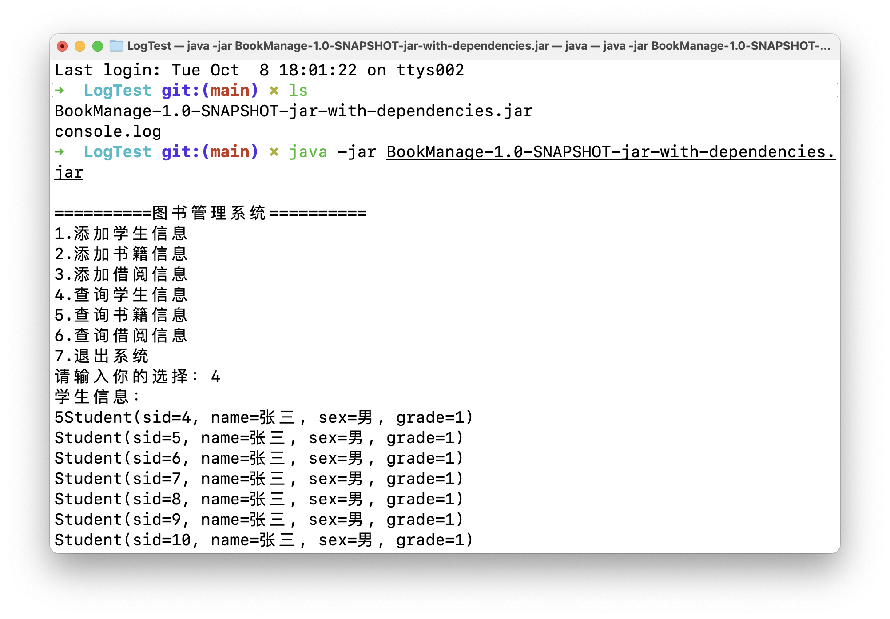

结果正确。

> 注意这个文件是STEP15bug处理前的文件

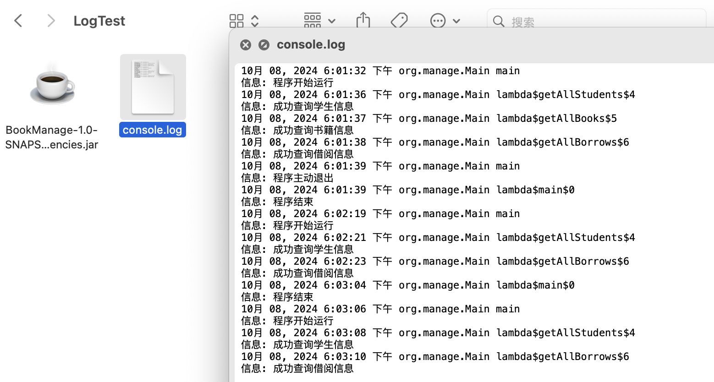

> 尝试把数据库改用公网IP的那个查看能否在别人电脑是上跑起来。

转存sql文件

> 注意数据库名称需要一样 book_manage

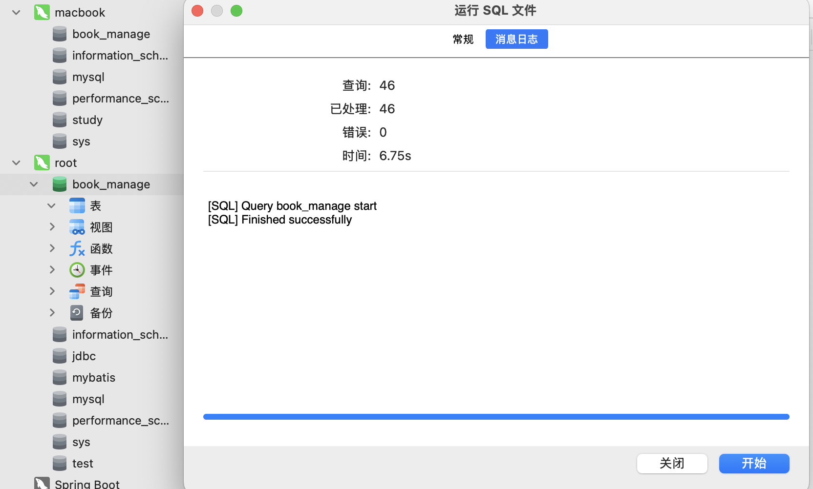

xml配置修改部分：

```xml
<property name="url" value="jdbc:mysql://120.76.200.202:3306/book_manage"/>
```

同样STEP14里面的xml就不修改了

公网数据库速度有点点慢啊

## 14.整理体系结构

```bash
.
├── main
│   ├── java
│   │   └── org
│   │       └── manage
│   │           ├── Main.java
│   │           ├── entity
│   │           │   ├── Book.java
│   │           │   ├── Borrow.java
│   │           │   └── Student.java
│   │           ├── mapper
│   │           │   └── BookMapper.java
│   │           └── sql
│   │               └── SqlUtil.java
│   └── resources
│       ├── logging.properties
│       └── mybatis-config.xml
└── test
    └── java
        └── com
            └── test
                └── Main.java
```

文件结构还是比较清晰的。

### entity

Book.java

```java
package org.manage.entity;

import lombok.Data;
import lombok.NoArgsConstructor;

@Data
@NoArgsConstructor
public class Book {
  int bid;

  public Book(String title, String desc, double price) {
    this.title = title;
    this.desc = desc;
    this.price = price;
  }

  String title;
  String desc;
  double price;
}
```

Borrow.java

```java
package org.manage.entity;

import lombok.Data;

@Data
public class Borrow {
  int id;
  Student student;
  Book book;
}
```

Student.java

```java
package org.manage.entity;

import lombok.Data;
import lombok.NoArgsConstructor;

@Data
@NoArgsConstructor
public class Student {
  int sid;

  public Student(String name, String sex, int grade) {
    this.name = name;
    this.sex = sex;
    this.grade = grade;
  }

  String name;
  String sex;
  int grade;
}
```

### mapper

```java
package org.manage.mapper;

import org.apache.ibatis.annotations.*;
import org.apache.ibatis.type.JdbcType;
import org.manage.entity.Book;
import org.manage.entity.Borrow;
import org.manage.entity.Student;

import java.util.List;

public interface BookMapper {
  @Insert("insert into student(name,sex,grade) values (#{name},#{sex},#{grade})")
  int addStudent(Student student);

  @Insert("insert into book(title,`desc`,price) values (#{title},#{desc},#{price})")
  int addBook(Book book);

  @Insert("insert into borrow(sid,bid) values (#{sid},#{bid})")
  int addBorrow(@Param("sid") int sid, @Param("bid") int bid);

  //  @Results({
//          @Result(column = "sid", property = "sid", id = true),
//          @Result(column = "name", property = "name"),
//          @Result(column = "sex", property = "sex", javaType = String.class, jdbcType = JdbcType.VARCHAR),
//          @Result(column = "grade", property = "grade")
//  })
  @Select("select * from student where sid = #{sid}")
  Student getStudentBySid(int sid);

  @Select("select * from book where bid = #{bid}")
  Book getBookByBid(int bid);

  @Select("select * from student")
  List<Student> getAllStudents();

  @Select("select * from book")
  List<Book> getAllBooks();

  @Results({
          @Result(column = "id", property = "id", id = true),
          @Result(column = "sid", property = "student", one = @One(select = "getStudentBySid")),
          @Result(column="bid",property="book",one=@One(select="getBookByBid"))
  })
  @Select("select * from borrow")
  List<Borrow> getAllBorrows();
}
```

### sql

SqlUtil.java

```java
package org.manage.sql;

import org.apache.ibatis.io.Resources;
import org.apache.ibatis.session.SqlSession;
import org.apache.ibatis.session.SqlSessionFactory;
import org.apache.ibatis.session.SqlSessionFactoryBuilder;
import org.manage.mapper.BookMapper;

import java.io.IOException;
import java.util.function.Consumer;

public class SqlUtil {
  private SqlUtil() {
  }

  private static SqlSessionFactory factory;
  // 私有的static对象

  static {
    try {
      factory = new SqlSessionFactoryBuilder().build(Resources.getResourceAsReader("mybatis-config.xml"));
      // 注意后面读取xml的方式
    } catch (IOException e) {
      e.printStackTrace();
    }
  }

  public static void doSqlWork(Consumer<BookMapper> consumer){
    try(SqlSession session=factory.openSession(true)){
        BookMapper mapper = session.getMapper(BookMapper.class);
        consumer.accept(mapper);
    }
  }
}
// 创建工具类 SqlUtil，用于获取 SqlSession 对象 显然易见，使用方式 SqlUtile.getSession() 即可获取 SqlSession 对象
```

### Main

```java
package org.manage;

import lombok.extern.java.Log;
import org.apache.ibatis.io.Resources;
import org.manage.entity.Book;
import org.manage.entity.Student;
import org.manage.entity.Borrow; // 假设你有 Borrow 类
import org.manage.sql.SqlUtil;

import java.io.IOException;
import java.util.List;
import java.util.Scanner;
import java.util.logging.LogManager;

import static java.lang.System.exit;

@Log
public class Main {
  public static void main(String[] args) throws IOException {
    LogManager manager = LogManager.getLogManager();
    manager.readConfiguration(Resources.getResourceAsStream("logging.properties"));
    // 这里是借助了Lombok的日志系统
    log.info("程序开始运行");
    Runtime.getRuntime().addShutdownHook(new Thread(() -> log.info("程序结束")));

    Scanner scanner = new Scanner(System.in);
    while (true) {
      System.out.println("==========图书管理系统==========");
      System.out.println("1.添加学生信息");
      System.out.println("2.添加书籍信息");
      System.out.println("3.添加借阅信息");
      System.out.println("4.查询学生信息");
      System.out.println("5.查询书籍信息");
      System.out.println("6.查询借阅信息");
      System.out.println("7.退出系统");
      System.out.print("请输入你的选择：");
      String input = scanner.nextLine();
      int check;
      try {
        check = Integer.parseInt(input);
      } catch (NumberFormatException e) {
        System.out.println("请输入正确的数字！！！");
        continue;
      }
      // 处理数据输入，
      switch (check) {
        case 1:
          addStudent(scanner);
          break;
        case 2:
          addBook(scanner);
          break;
        case 3:
          addBorrow(scanner);
          break;
        case 4:
          getAllStudents();
          break;
        case 5:
          getAllBooks();
          break;
        case 6:
          getAllBorrows();
          break;
        case 7:
          log.info("程序主动退出");
          exit(0);
        default:
          System.out.println("无效选择，请重试。");
          break;
      }
    }
  }

  private static void addStudent(Scanner scanner) {
    System.out.print("请输入学生姓名：");
    String name = scanner.nextLine();
    System.out.print("请输入学生性别(boy/girl)：");
    String sex = scanner.nextLine();
    System.out.print("请输入学生年级：");
    String stringGrade = scanner.nextLine();
    int grade = Integer.parseInt(stringGrade);
    SqlUtil.doSqlWork(mapper -> {
      Student student = new Student(name, sex, grade);
//      int result = mapper.addStudent(new Student(name, sex, grade));
      int result = mapper.addStudent(student);
      if (result > 0) {
        log.info("添加学生信息成功" + student);
        System.out.println("添加学生信息成功");
      }
      else{
        log.info("添加学生信息失败" + student);
        System.out.println("添加学生信息失败");
      }
    });
  }

  private static void addBook(Scanner scanner) {
    System.out.print("请输入书籍名称：");
    String title = scanner.nextLine();
    System.out.print("请输入书籍描述：");
    String desc = scanner.nextLine();
    System.out.print("请输入书籍价格：");
    String stringPrice = scanner.nextLine();
    double price = Double.parseDouble(stringPrice);
    SqlUtil.doSqlWork(mapper -> {
      int result = mapper.addBook(new Book(title, desc, price));
      if (result > 0) {
        log.info("添加书籍信息成功" + new Book(title, desc, price));
        System.out.println("添加书籍信息成功");
      }
      else {
        log.info("添加书籍信息失败" + new Book(title, desc, price));
        System.out.println("添加书籍信息失败");
      }
    });
  }

  private static void addBorrow(Scanner scanner) {
    System.out.print("请输入学生id：");
    String stringSid = scanner.nextLine();
    int sid = Integer.parseInt(stringSid);
    System.out.print("请输入书籍id：");
    String stringBid = scanner.nextLine();
    int bid = Integer.parseInt(stringBid);
    SqlUtil.doSqlWork(mapper -> {
      int result = mapper.addBorrow(sid, bid);
      if (result > 0) {
        log.info("添加借阅信息成功" + "Borrow{sid="+ sid +", bid="+ bid +"}");
        System.out.println("添加借阅信息成功");
      }
      else {
        log.info("添加借阅信息失败" + "Borrow{sid="+ sid +", bid="+ bid +"}");
        System.out.println("添加借阅信息失败");
      }
    });
  }

  private static void getAllStudents() {
    SqlUtil.doSqlWork(mapper -> {
      List<Student> students = mapper.getAllStudents();
      if (students.isEmpty()) {
        log.info("没有找到学生信息。");
        System.out.println("没有找到学生信息。");
      } else {
        log.info("成功查询学生信息");
        System.out.println("学生信息：");
        for (Student student : students) {
          System.out.println(student);
        }
      }
    });
  }

  private static void getAllBooks() {
    SqlUtil.doSqlWork(mapper -> {
      List<Book> books = mapper.getAllBooks();
      if (books.isEmpty()) {
        log.info("没有找到书籍信息。");
        System.out.println("没有找到书籍信息。");
      } else {
        log.info("成功查询书籍信息");
        System.out.println("书籍信息：");
        for (Book book : books) {
          System.out.println(book);
        }
      }
    });
  }

  private static void getAllBorrows() {
    SqlUtil.doSqlWork(mapper -> {
      List<Borrow> borrows = mapper.getAllBorrows();
      if (borrows.isEmpty()) {
        log.info("没有找到借阅信息。");
        System.out.println("没有找到借阅信息。");
      } else {
        log.info("成功查询借阅信息");
        System.out.println("借阅信息：");
        for (Borrow borrow : borrows) {
          System.out.println(borrow);
        }
      }
    });
  }
}
```

### resources

logging.properties

```properties
handlers=java.util.logging.FileHandler
.level=INFO
java.util.logging.FileHandler.pattern = console.log
java.util.logging.FileHandler.limit = 50000
java.util.logging.FileHandler.count = 1
java.util.logging.FileHandler.formatter = java.util.logging.SimpleFormatter
java.util.logging.FileHandler.append = true
# 从上到下
# handler 用来指定日志处理器
# .level 用来指定日志级别
# java.util.logging.FileHandler.pattern 用来指定日志文件的路径
# java.util.logging.FileHandler.limit 用来指定日志文件的大小
# java.util.logging.FileHandler.count 用来指定日志文件的数量
# java.util.logging.FileHandler.formatter 用来指定日志的格式
# java.util.logging.FileHandler.append 用来指定是否追加日志
# 最重要的是patter formatter 和append
```

mybaits.xml

```xml
<?xml version="1.0" encoding="UTF-8" ?>
<!DOCTYPE configuration
        PUBLIC "-//mybatis.org//DTD Config 3.0//EN"
        "http://mybatis.org/dtd/mybatis-3-config.dtd">
<configuration>
    <environments default="development">
        <environment id="development">
            <transactionManager type="JDBC"/>
            <dataSource type="POOLED">
                <property name="driver" value="com.mysql.cj.jdbc.Driver"/>
                <property name="url" value="jdbc:mysql://localhost:3306/book_manage"/>
                <property name="username" value="root"/>
                <property name="password" value="mobaisilent"/>
            </dataSource>
        </environment>
    </environments>
    <mappers>
        <mapper class="org.manage.mapper.BookMapper"/>
    </mappers>
</configuration>
```

### pom.xml

```xml
<?xml version="1.0" encoding="UTF-8"?>
<project xmlns="http://maven.apache.org/POM/4.0.0"
         xmlns:xsi="http://www.w3.org/2001/XMLSchema-instance"
         xsi:schemaLocation="http://maven.apache.org/POM/4.0.0 http://maven.apache.org/xsd/maven-4.0.0.xsd">
    <modelVersion>4.0.0</modelVersion>

    <groupId>org.example</groupId>
    <artifactId>BookManage</artifactId>
    <version>1.0-SNAPSHOT</version>

    <properties>
        <maven.compiler.source>22</maven.compiler.source>
        <maven.compiler.target>22</maven.compiler.target>
        <project.build.sourceEncoding>UTF-8</project.build.sourceEncoding>
    </properties>

    <dependencies>
        <dependency>
            <groupId>com.google.protobuf</groupId>
            <artifactId>protobuf-java</artifactId>
            <version>3.21.7</version>
        </dependency>
        <dependency>
            <groupId>org.mybatis</groupId>
            <artifactId>mybatis</artifactId>
            <version>3.5.8</version>
        </dependency>
        <dependency>
            <groupId>org.projectlombok</groupId>
            <artifactId>lombok</artifactId>
            <version>1.18.34</version>
            <scope>provided</scope>
        </dependency>
        <!-- https://mvnrepository.com/artifact/mysql/mysql-connector-java -->
        <dependency>
            <groupId>mysql</groupId>
            <artifactId>mysql-connector-java</artifactId>
            <version>8.0.33</version>
        </dependency>
        <dependency>
            <groupId>junit</groupId>
            <artifactId>junit</artifactId>
            <version>4.12</version>
            <scope>test</scope>
        </dependency>

    </dependencies>

    <build>
        <plugins>
            <plugin>
                <artifactId>maven-assembly-plugin</artifactId>
                <version>3.7.1</version>
                <configuration>
                    <descriptorRefs>
                        <descriptorRef>jar-with-dependencies</descriptorRef>
                    </descriptorRefs>
                    <archive>
                        <manifest>
                            <addClasspath>true</addClasspath>
                            <mainClass>org.manage.Main</mainClass>
                        </manifest>
                    </archive>
                </configuration>
                <executions>
                    <execution>
                        <id>make-assembly</id>
                        <phase>package</phase>
                        <goals>
                            <goal>single</goal>
                        </goals>
                    </execution>
                </executions>
            </plugin>
            <plugin>
                <artifactId>maven-surefire-plugin</artifactId>
                <groupId>org.apache.maven.plugins</groupId>
                <version>3.5.1</version>
            </plugin>
        </plugins>
    </build>

</project>
        <!--呵呵 还是用比较好的网站更新下jar包版本吧，不然使用不了-->
```

> 保持我一贯的作风，只用最新的

改项目正式结束，非常开心，新体系效率非常高，大概为之前的10倍吧！！继续加油吧！！！

## 15.BUG处理

> bug等级：高危

仔细思考发现我对添加borrw的时候没有错误处理。

需要修改addBorrow方法

如果不存在主键的话会报错

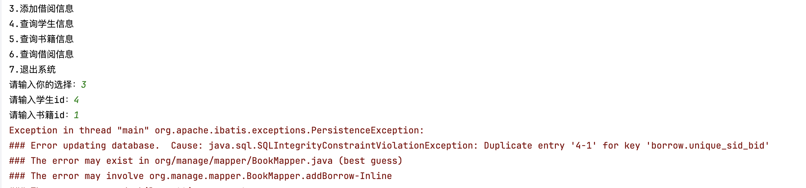

修改Main的addBorrow方法

```java
  private static void addBorrow(Scanner scanner) {
    System.out.print("请输入学生id：");
    String stringSid = scanner.nextLine();
    int sid = Integer.parseInt(stringSid);
    System.out.print("请输入书籍id：");
    String stringBid = scanner.nextLine();
    int bid = Integer.parseInt(stringBid);
    // 这里根据输入的sid和bid进行检验即可getStudentBySid和getBookByBid
    SqlUtil.doSqlWork(mapper -> {
      if (mapper.getStudentBySid(sid) == null) {
        log.info("插入借阅信息但是学生id不存在");
        System.out.println("学生id不存在，请先检查学生信息");
        return;
      } else if (mapper.getBookByBid(bid) == null) {
        log.info("插入借阅信息但是书籍id不存在");
        System.out.println("书籍id不存在，请先检查书籍信息");
        return;
      } else {
        int result = mapper.addBorrow(sid, bid);
        if (result > 0) {
          log.info("添加借阅信息成功" + "Borrow{sid=" + sid + ", bid=" + bid + "}");
          System.out.println("添加借阅信息成功");
        } else {
          log.info("添加借阅信息失败" + "Borrow{sid=" + sid + ", bid=" + bid + "}");
          System.out.println("添加借阅信息失败");
        }
      }
    });
  }
```

STEP14里面的Main就不对应更改了，保持STEP15的独立性。

## 16.GIT操作

> 给项目打标签发行V1.0

查看所有tag

```bash
git tag
```

打上tag

```bash
git tag v1.0
# 直接打上标签v1.0

git tag -a v1.0 -m "-a表示需要打上注释信息，然后-m就接着注释信息即可"

git tag -a v1.0
# vim编辑器打上tag，不接上-m会自动进入vim编辑器
```

补打tag标签

```bash
git tag -a v3.0 ff28fd51 -m "给之前的提交记录打tag" 
# 找到commit的hash值即可
```

```bash
git log
# 查看所有commit信息

git log --oneline
# 顾名思义
```

查看tag详细信息

```bash
git show v1.0
```

将tag同步到远程仓库

```bash
git push origin v3.0
# 将本地名为 v3.0 的标签推送至远程仓库

git push origin --tags
# 将本地所有标签一次性推送至远程仓库，也就是正常的push操作后面添加点参数就行了
```

切换tag

```bash
git checkout v3.0
git checkout -b [newbranchname] [tagname]
```

删除本地tag

```bash
git tag -d v1.0
```

删除远程tag

```bash
git push origin :refs/tags/v2.0
git push origin --delete v1.0
```

> 开发工具中command + option + ⬇️键能向下再开一个光标

> CSDN真是依托，不多评价。
